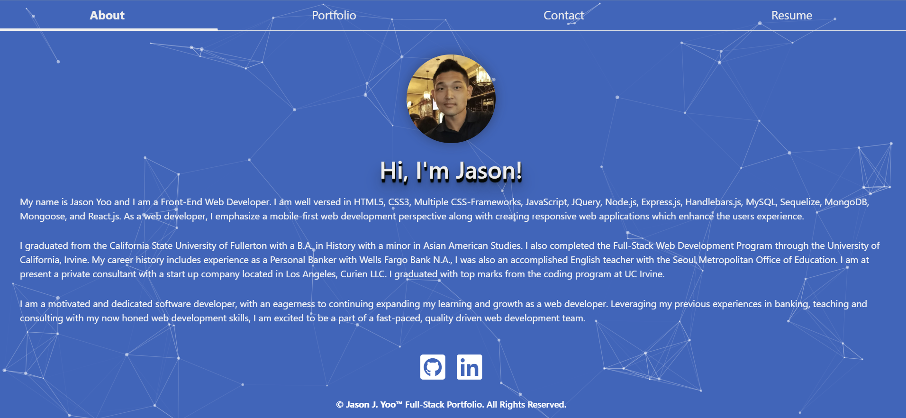

# React Portfolio

My Professional Portfolio - Build with React.js

 

## Description: 

A Portfolio built with React.js

  

## Table of Contents:

 

- [Deployed](#deployed)
- [Usage](#usage)
- [Credits](#credits)
- [License](#license)
- [Badges](#badges)
- [Features](#features)
- [How](#howtocontribute)
- [Tests](#tests)
- [Details](#details)
- [Github](#github)
- [URL](#url)
- [Author](#author)
- [Questions](#questions)

 

## Deployed
 
** Go to <a href="https://jasonjayoo.github.io/jasonyoo-fullstack-portfolio/" target="_blank">My-Portfolio</a> In order to view My React Portfolio Webpage.

 
 

## Usage: 

 

[Screenshot](./src/assets/Screenshot.png)  "Deployed Landing Page"

 
 

## Credits:

- I would like to thank my esteemed cohort member Mr. Marcus Lewis for introducing me to tsparticles!

 

## License:
 
    -  MIT License - Copyright (c) 2022 Jason Yoo
 
 

## Badges:
 
    - UCI Full Stack Bootcamp Graduate circa 2022
 
 

## Features:
 
    - Dynamic single page application built with React.js
    - Picture of me and some information about myself
    - Information of my educational background
    - Images/links of my six main projects, links to the deploy websites and github repositories.
    - Contact section with links to my resume, email, and linkedin profile with links once clicked will open new tab. 

 
 

## How to Contribute:
 
    - My github repository is publically viewable. If you would to contribute to the webpage please email me at my link on the webpage with you github username and I will add you as a contributor on the repo. 
 
 

## Tests:
 
    - You can test out the webpage on vsc or directly in the inspect window of your browser. 
 
 

## Details:

 

1. Implemented npm packages [axios, tsparticles, bootstrap, pretty] in conjunction with React.js
2. JSX was utilized to render the front-end UI.
3. My resume is downloadable to users.
4. List of my programming knowledge located in a togglable carousel.
5. Asyncronous user interface.

 

## Github (Github Repository):

Click [here](https://github.com/jasonjayoo/jasonyoo-fullstack-portfolio) to go to my React Portfolio Github Repository

 

## URL (Published Webpage):

<a href="https://jasonjayoo.github.io/jasonyoo-fullstack-portfolio/" target="_blank">My-Portfolio</a>

## Author:
                         Jason Yoo
  

## Questions:
  For any questions regarding this application, you may reach me directly at jasonjayoo@outlook.com.

  To view my other applications, please check out my github page [jasonjayoo](https://github.com/jasonjayoo).

